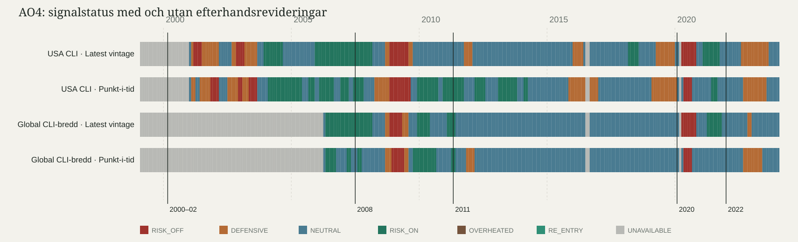

# AO4 — punkt-i-tid-historik för OECD CLI

> Forskningsdiagnostik. Detta är en mätning av revisions- och realtidseffekten, inte ett prediktivt test. S3 har inte körts.

## De två förhandsbestämda huvuddiagnoserna

- **32,2 %** av jämförbara profilmånader hade annan status i punkt-i-tid än i `LATEST_VINTAGE_SIMULATION` (156 av 485).
- **Riktningen är obestämd (n=6).** Första `DEFENSIVE`/`RISK_OFF` fick median **+0,5 mån**, medelvärde **-0,33 mån** och spann **-5 mån till +1 mån** när samma referensmånad räknades med historisk respektive senaste vintage. De sex värdena var -5 mån, +0 mån, +0 mån, +1 mån, +1 mån, +1 mån.

**2008 går åt motsatt håll mot en enkel efterklokhetshypotes.** För USA CLI gav punkt-i-tid `DEFENSIVE`/`RISK_OFF` i 2008-04, medan senaste reviderade data gav första träff i 2008-09: punkt-i-tid var fem månader tidigare. Det är materialets enda stora timingavvikelse och dess viktigaste episod. Därför får medianen +0,5 inte användas som belägg för att realtidssignalen generellt var senare.

**Publiceringslaggen är en separat komponent.** I de sex parade punkt-i-tid-träffarna var avståndet mellan referensmånad och arkivedition 1–2 månadssteg, median **1,5 månader**. Om medianerna ändå summeras pedagogiskt blir det 1,5 + 0,5 ≈ **2,0 månader**, inte 2,5. Eftersom revisionstimingen har motsatt tecken i median och medelvärde är inte heller 2,0 en validerad skattning av total prognosfördröjning.

### Kontroll av publiceringssteget

Steget räknas som arkiveditionens månad minus senaste användbara referensmånad; ingen inklusiv extramånad läggs till. `202001` innehåller till och med `2019-11` för båda proxyerna och ger korrekt 2 steg. Laggen varierar faktiskt i OECD-arkivet:

- USA CLI: 48 editioner med 1 steg och 226 med 2; median 2.
- Global CLI-bredd: 47 editioner med 1 steg, 153 med 2 och 11 med 3; median 2.

Exempelvis innehåller edition `202005` data till och med `2020-04` och ger därför genuint 1 steg. Variationen är källdata, inte off-by-one i koden.

## Det viktigaste fyndet: produktionssignalen kan inte återskapas troget

- USA-produktionen väger CLI/BCI/CCI 0,4/0,3/0,3, men BCI och CCI saknar arkivvintages. `usa_cli_only` är därför en proxy.
- Global produktion väger G20/bredd 0,6/0,4, men G20 har bara 13 arkiveditioner. `global_cli_breadth_only` är därför en proxy.
- Sverige saknar publika historiska värdevintages och kan inte byggas i punkt-i-tid-grenen.
- Ingen av de tre publicerade domänerna — och därmed inte syntesen — har alltså en trogen punkt-i-tid-motsvarighet i detta arkiv.

S2 validerar därför inte produktionens historik. En eventuell S3-förregistrering måste låsa detta som en designbegränsning. En möjlig tvågrensdesign är proxy-punkt-i-tid som primär, latest vintage som deklarerad sekundär och skillnaden i prognosprestanda som eget mått på facitinflation. Detta dokument genomför eller låser inte S3.

## En tabell

| Profil | Täckta editionmånader | Jämförbara | Olika status | Andel | Parade timingskift |
|---|---:|---:|---:|---:|---:|
| `usa_cli_only` | 274 / 300 | 274 | 113 | 41,2 % | -5 mån, +0 mån, +1 mån, +1 mån |
| `global_cli_breadth_only` | 211 / 300 | 211 | 43 | 20,4 % | +0 mån, +1 mån |
| **Totalt** | — | **485** | **156** | **32,2 %** | **-5 mån, +0 mån, +0 mån, +1 mån, +1 mån, +1 mån** |

*Profilandelarna är inte direkt jämförbara.* USA-proxyn har 274 tillgängliga editionmånader från 2001-01, medan global breadth har 211 från 2006-04. USA innehåller därför bland annat 2001-recessionen och en längre uppladdning inför 2008; revisionskänsligheten kan skilja mellan epoker.

## De sex timingparen

- **USA CLI, 2000–02:** latest `2001-02`, punkt-i-tid `2001-02`, revisionseffekt **+0 mån**; punkt-i-tid-träffen byggde på referensmånad `2000-12` och kom i en edition 2 månadssteg senare.
- **USA CLI, 2008:** latest `2008-09`, punkt-i-tid `2008-04`, revisionseffekt **-5 mån**; punkt-i-tid-träffen byggde på referensmånad `2008-02` och kom i en edition 2 månadssteg senare.
- **USA CLI, 2020:** latest `2020-04`, punkt-i-tid `2020-05`, revisionseffekt **+1 mån**; punkt-i-tid-träffen byggde på referensmånad `2020-04` och kom i en edition 1 månadssteg senare.
- **USA CLI, 2022:** latest `2022-08`, punkt-i-tid `2022-09`, revisionseffekt **+1 mån**; punkt-i-tid-träffen byggde på referensmånad `2022-08` och kom i en edition 1 månadssteg senare.
- **Global CLI-bredd, 2008:** latest `2008-09`, punkt-i-tid `2008-09`, revisionseffekt **+0 mån**; punkt-i-tid-träffen byggde på referensmånad `2008-07` och kom i en edition 2 månadssteg senare.
- **Global CLI-bredd, 2020:** latest `2020-04`, punkt-i-tid `2020-05`, revisionseffekt **+1 mån**; punkt-i-tid-träffen byggde på referensmånad `2020-04` och kom i en edition 1 månadssteg senare.

## En graf

Grafen visar proxyserierna sida vid sida. Den får inte etiketteras som en trogen punkt-i-tid-version av de publicerade domänsignalerna eller syntesen.

## Datatäckning och avgränsning

- OECD:s officiella metadata innehöll 65 locations och 300 månadseditioner 1999-02–2024-01. Planens 66/301 kunde inte verifieras och användes inte.
- Alla 14 låsta breadth-länder finns i VAR 303. USA och sex andra utvecklade länder har editioner från 2001-01; de sju övriga breadth-länderna tillkommer 2006-04.
- G20-aggregatet har bara 13 editioner 2023-01–2024-01. Därför används den separat låsta `global_cli_breadth_only`, inte en falskt produktionslik global profil.
- USA använder `usa_cli_only`; BCI och CCI blandas inte in eftersom de saknar arkivvintages. Sverige är uteslutet eftersom publika historiska värdevintages saknas.
- Skillnadsandelen räknas endast när båda lägena är beräkningsbara. Otillgängliga månader redovisas som täckningsbrist och får inte skapa artificiella skillnader.

## Reproducerbarhet

- Låst konfiguration SHA-256: `08fbfce72ada29a9983bdc00b7bba902fb2eecb61ec503cff3bae1419c2a525f`.
- OECD-råsvar SHA-256 (okomprimerat): `08650c3017e71a663812babe4970a7fc737f38982608788a16d5893ad1ee6900`.
- Senaste-vintage-databasens observationsfingeravtryck: `b4da18e1f3243efbbda1e5038e6985e7baecca346895833c08651f0affe359e6`.
- Signaltrösklar och hysteres kommer oförändrade från engine 2.0.0. Inget prognosutfall eller marknadslabel används i denna diagnos.
